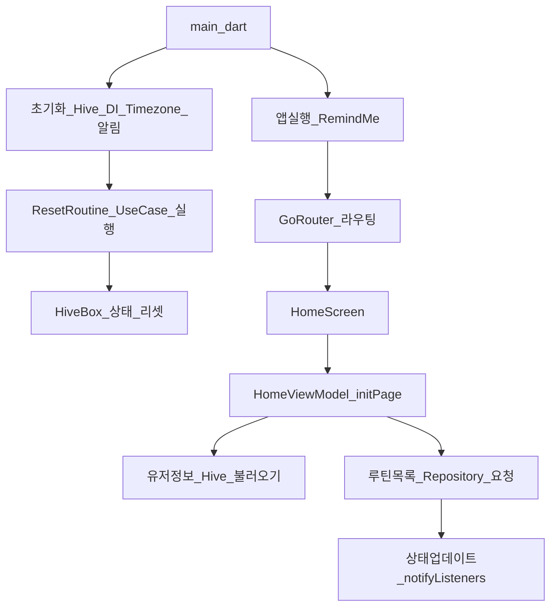
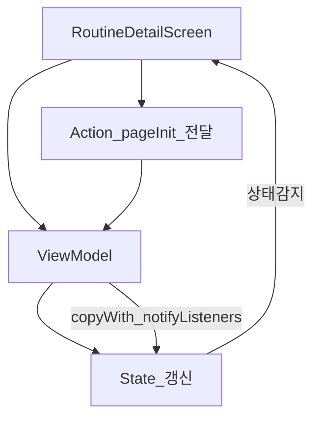
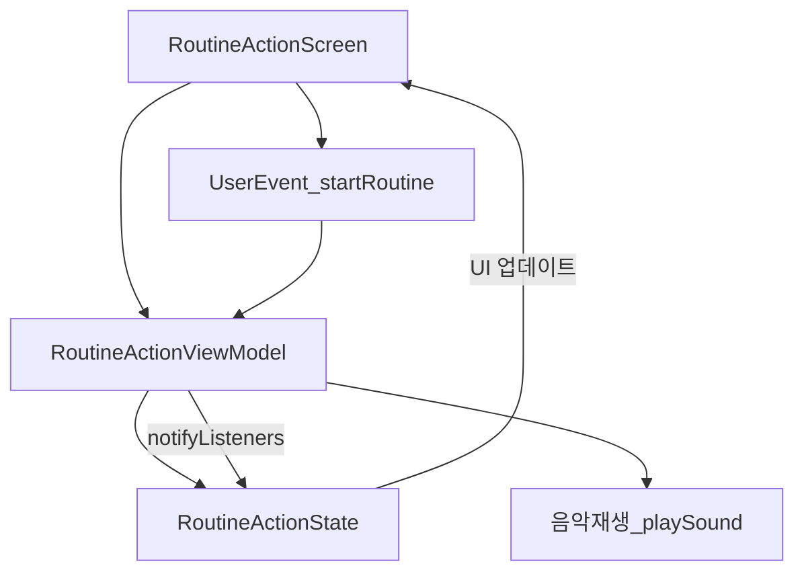

# 🕑 RemindMe


Flutter 3.29.2 기반 루틴 알림 앱입니다. 사용자의 루틴을 매일 추적하며 알림과 함께 지속적인 습관 형성을 도와줍니다. 앱은 클린 아키텍처 패턴으로 구성되며, 을 사용한 상태 관리, Hive 기반의 로컬 데이터 저장소, 로컬 푸시 알림을 통해 독립적이고 테스트 가능한 구조를 가집니다.

---

## 📦 주요 기능 요약

| 기능             | 설명 |
|------------------|------|
| 루틴 생성/편집/삭제 | 사용자가 반복적으로 수행하는 작업들을 관리 |
| 루틴 완료 상태 리셋 | 하루가 지나면 자동으로 `isCompletedToday` 필드를 초기화 |
| 알림 스케줄링     | 사용자가 설정한 시간에 로컬 푸시 알림 전송 |
| 화면 전환 (GoRouter) | Splash → 로그인/회원가입 → 메인 화면 구조 |
| 상태 관리         | `ChangeNotifier` 기반 ViewModel로 상태 추적 |
| 로컬 저장소       | `hive` 기반으로 유저 및 루틴 데이터 저장 |
| 의존성 주입       | `get_it` 패키지를 통해 UseCase 및 Repository 주입 |

---

## 🧱 아키텍처 구조

```
lib/
├── core/               # 공통 서비스 (Hive, 알림, DI 등)
├── data/               # 데이터 모델 및 Repository 구현
├── domain/             # 도메인 모델, 유스케이스, 인터페이스
├── view/               # UI 및 ViewModel
├── routes/             # 라우팅 설정
└── main.dart           # 앱 진입점
```

---

---

---

## 🔄 앱 데이터 흐름도 (GitHub 완전 호환 버전)



---

## ▶️ 루틴 상세 실행 상태 흐름도



---

## ▶️ 루틴 실행 상태 흐름도 (routine_action)




---

## 📱 iOS 앱 다운로드

[**➡ App Store에서 RemindMe 다운로드하기**](https://apps.apple.com/kr/app/%EB%A6%AC%EB%A7%88%EC%9D%B8%EB%93%9C-%EB%AF%B8/id6745143696)

이 앱은 iOS 기기에서 사용할 수 있으며, 사용자에게 맞춤형 루틴 리마인더 경험을 제공합니다.  
**알림**, **루틴 추적**, **디자인 접근성 모드**를 지원합니다.


## 📝 개인정보 처리방침

`PRIVACY_POLICY.md` 참조

## 🔍 코드 해석 문서
🧩 RoutineAddViewModel 코드 해석 (https://github.com/YunFlutter/remindme_app/blob/work_space/code_interpretation/README_routine_add_view_model.md)
🗂️ RoutineAddState 코드 해석 (https://github.com/YunFlutter/remindme_app/blob/work_space/code_interpretation/README_routine_add_state.md)
🎬 RoutineActionViewModel 코드 해석 (https://github.com/YunFlutter/remindme_app/blob/work_space/code_interpretation/README_routine_action_view_model.md)
🔄 RoutineActionState / Event 코드 해석 (https://github.com/YunFlutter/remindme_app/blob/work_space/code_interpretation/README_routine_action_state_event.md)