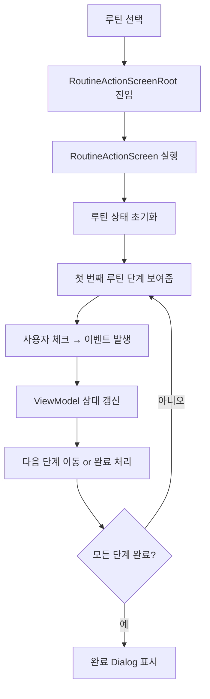

# ▶️ 루틴 실행 기능 전체 구조 및 흐름

이 문서는 루틴을 실제로 실행하고 완료하는 과정을 담당하는 구성요소들을 정리합니다.
`RoutineActionScreen`을 중심으로 ViewModel, State, Event, Dialog 흐름까지 모두 포함하며 자세한 코드 설명이 포함되어 있습니다.

---

## 📊 실행 흐름 다이어그램



---

## 🖥 1. RoutineActionScreenRoot

```dart
// 루틴 ID를 전달받고 실제 실행 화면으로 라우팅하는 진입점 위젯입니다.
class RoutineActionScreenRoot extends StatelessWidget {
...
}
```

- GoRouter 등의 경로에서 진입할 때 사용
- 내부적으로 `RoutineActionScreen`을 생성하며 `routineId`를 전달

---

## 🧭 2. RoutineActionScreen

```dart
// 루틴 실행 UI를 담당합니다. 상태는 ViewModel을 통해 구독합니다.
class RoutineActionScreen extends ConsumerWidget {
@override
Widget build(BuildContext context, WidgetRef ref) {
final viewModel = ref.watch(routineActionViewModelProvider.notifier);
final state = ref.watch(routineActionViewModelProvider);
...
}
}
```

- 현재 루틴의 단계별 상태, 남은 단계 수, 완료 여부 등을 표시
- 사용자 동작(예: "체크" 버튼 클릭)에 따라 ViewModel에 이벤트 전달

---

## 🎛 3. RoutineActionViewModel

```dart
// 상태를 관리하며 사용자 입력(이벤트)을 받아 상태를 갱신합니다.
class RoutineActionViewModel extends StateNotifier<RoutineActionState> {
void onEvent(RoutineActionEvent event) {
switch (event) {
case RoutineActionEvent.checked(...):
// 현재 단계 체크 처리 → 다음 단계 이동
case RoutineActionEvent.reset():
// 루틴 리셋 처리
}
}
}
```

- `StateNotifier`를 사용해 상태를 갱신하며, UI에 반영
- 루틴 실행 중 완료 시 `showRoutineCompleteDialog`를 호출하여 UI에 표시

---

## 🧠 4. RoutineActionState

```dart
// 실행 중인 루틴의 상태입니다. 현재 몇 번째 단계인지, 완료 여부 등을 포함합니다.
@freezed
class RoutineActionState with _$RoutineActionState {
const factory RoutineActionState({
required List<RoutineStepModel> steps,
required int currentIndex,
required bool isComplete,
}) = _RoutineActionState;
}
```

- 상태는 불변이며 `copyWith`로 갱신
- `currentIndex`를 증가시켜 다음 단계로 이동하거나 `isComplete`를 true로 변경

---

## 🔁 5. RoutineActionEvent

```dart
// 사용자의 루틴 실행 중 액션을 정의합니다.
@freezed
class RoutineActionEvent with _$RoutineActionEvent {
const factory RoutineActionEvent.checked(int index) = Checked;
const factory RoutineActionEvent.reset() = Reset;
}
```

- 어떤 단계가 완료되었는지 명시
- 전체 리셋 요청 등도 이 enum 기반 이벤트로 처리

---

## 🎉 6. showRoutineCompleteDialog

```dart
// 루틴 완료 시 호출되는 다이얼로그입니다.
showRoutineCompleteDialog(BuildContext context) {
showDialog(...); // 루틴 완료 축하 메시지 표시
}
```

- 실행이 끝나면 ViewModel에서 이 메서드를 호출
- 사용자에게 피드백 제공 + 홈으로 돌아갈 수 있도록 안내

---

## ✅ 전체 흐름 요약

| 항목 | 설명 |
|------|------|
| RoutineActionScreenRoot | 진입점 (routineId 전달) |
| RoutineActionScreen | 실행 UI |
| ViewModel | 상태 갱신 및 이벤트 처리 |
| State | 현재 단계와 완료 상태 |
| Event | 사용자 액션 모델링 |
| Dialog | 완료 시 피드백 표시 |

