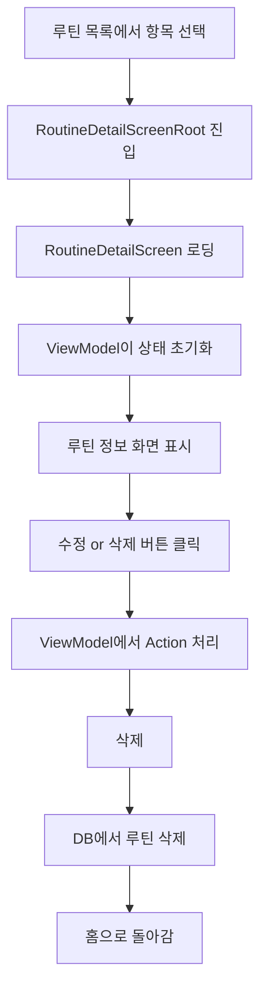

# 🔍 루틴 상세 보기 기능 전체 구조 및 흐름

루틴의 상세 정보를 조회하고 수정 또는 삭제할 수 있는 화면 구조를 설명합니다. `RoutineDetailScreen`을 중심으로 ViewModel, State, Action 클래스의 구조와 역할을 함께 설명합니다.

---

## 📊 루틴 상세 흐름 다이어그램



---

## 🖥 1. RoutineDetailScreenRoot

```dart
// 라우팅 시 진입 지점이 되는 위젯입니다.
class RoutineDetailScreenRoot extends StatelessWidget {
  final int routineId;
  ...
}
```

- 외부에서 routineId를 받아 상세 화면을 보여줍니다.
- 내부적으로 ViewModel과 함께 `RoutineDetailScreen`으로 진입합니다.

---

## 📋 2. RoutineDetailScreen

```dart
// 루틴 정보를 화면에 보여주는 주요 위젯입니다.
class RoutineDetailScreen extends ConsumerWidget {
  @override
  Widget build(BuildContext context, WidgetRef ref) {
    final viewModel = ref.watch(routineDetailViewModelProvider.notifier);
    final state = ref.watch(routineDetailViewModelProvider);
    ...
  }
}
```

- 루틴 제목, 시간, 색상, 단계 목록 등 정보를 보여줍니다.
- 수정/삭제 버튼이 포함되어 있고, ViewModel 액션을 호출합니다.

---

## 🧠 3. RoutineDetailViewModel

```dart
class RoutineDetailViewModel extends StateNotifier<RoutineDetailState> {
  void onAction(RoutineDetailAction action) {
    switch (action) {
      case RoutineDetailAction.delete():
        // 루틴 삭제 로직 실행
      case RoutineDetailAction.edit():
        // 수정 화면으로 이동
    }
  }
}
```

- 상태는 `RoutineDetailState`를 사용하고,
- 유저 액션은 `RoutineDetailAction`을 통해 모델링됩니다.

---

## 🔁 4. RoutineDetailAction

```dart
@freezed
class RoutineDetailAction with _$RoutineDetailAction {
  const factory RoutineDetailAction.delete() = Delete;
  const factory RoutineDetailAction.edit() = Edit;
}
```

- 사용자의 요청을 명확한 타입으로 표현
- 삭제 및 수정 두 가지 액션만 정의되어 있습니다.

---

## 🧾 5. RoutineDetailState

```dart
@freezed
class RoutineDetailState with _$RoutineDetailState {
  const factory RoutineDetailState({
    required RoutineModel routine,
    @Default(false) bool isDeleted,
  }) = _RoutineDetailState;
}
```

- `routine`: 상세 내용 표시를 위한 핵심 데이터
- `isDeleted`: 삭제 후 홈으로 돌아가기 위한 상태 표시

---

## ✅ 전체 흐름 요약

| 구성 요소 | 역할 |
|-----------|------|
| RoutineDetailScreenRoot | 라우팅 진입점 |
| RoutineDetailScreen | UI 렌더링 |
| RoutineDetailViewModel | 상태 제어 |
| RoutineDetailState | 불변 상태 정의 |
| RoutineDetailAction | 명확한 유저 액션 구분 |

---

